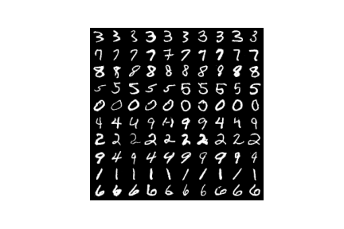
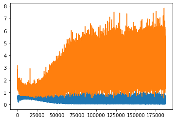

# InfoGAN
PyTorch implementation of InfoGAN

## Install

```
git clone https://github.com/yjang43/InfoGAN.git
pip install -r requirements.txt
```

## Run
Run each cell in main.ipynb file.

Sometimes, GitHub has issue of loading .ipynb files.

If that is a case, go to [https://nbviewer.jupyter.org/github/yjang43/InfoGAN/blob/master/main.ipynb](https://nbviewer.jupyter.org/github/yjang43/InfoGAN/blob/master/main.ipynb)

## Result
The image below is the generated MNIST data with latent code fixed for each row.




Train loss progression to 50 epochs with 16 batch


